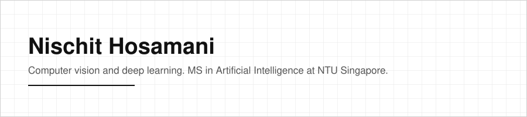

[LinkedIn](https://www.linkedin.com/in/nischit29/) · [nischitv29@gmail.com](mailto:nischitv29@gmail.com)

---

### About

This page points to finished, working projects rather than mirroring a resume.

- Pursuing an MSc in Artificial Intelligence at Nanyang Technological University, Singapore.
- BTech in Computer Science and Engineering, IIT Indore.
- Focused on computer vision and deep learning architectures.
- Published research on hyperspectral image denoising at [WACV 2024](https://ieeexplore.ieee.org/document/10944020).

No work history section here. This space stays project and research focused.

### Tech Stack

**Languages:** Python, C/C++, Java, JavaScript, Bash/Shell

**AI/ML:** PyTorch, TensorFlow, OpenCV, Scikit-learn, Keras, Pandas, NumPy, LangGraph, Pydantic, VectorDB

**Infrastructure:** Docker, Kubernetes, Kafka, Redis, MySQL, GCP, AWS, CI/CD

### Flagship Projects

| Project | What it does | Stack |
|---|---|---|
| [DeRaining](https://github.com/Nischit290402/DeRaining) | Hybrid CNN-Vision Transformer model that removes rain streaks from images, built on the DGNL-Net architecture. Converges in 20 training epochs, compared to 40,000 for a pure CNN. | PyTorch, OpenCV, Transformer |
| [OmniRec](https://github.com/Nischit290402/tiktok-autonomous-ml-agent) | Autonomous ML research agent that invents, implements, trains, and evaluates recommender-system architectures without human input. Built for TikTok TechJam Hackathon 2026. | Python |
| [MCP-X](https://github.com/Nischit290402/daytona-hackathon) | Autonomous compiler that turns REST APIs into verified, enterprise-hardened MCP servers with no manual coding required. Built for Daytona HackSprint Singapore 2026. | Python |
| [TrackX](https://github.com/Nischit290402/TrackX) | Low-latency, browser-based hand-tracking system with adaptive smoothing (1€ filter), WASM-accelerated MediaPipe inference, and Docker/Kubernetes deployment. | JavaScript, WASM |

### Open Source and Collaborative Work

[Accord](https://github.com/ShreyanshGoyal/top_secret): an agentic Slack-policy-decision tool wired to GitHub and a read-only ClickHouse view. I designed and built the test-fixture harness and 8-scenario verification suite the agent is validated against, including a hash-verified policy generator and a matched pair of demo PRs (a cosmetic-only fix and a real fix) used to prove the system tells them apart.

### Contact

[LinkedIn](https://www.linkedin.com/in/nischit29/) · [nischitv29@gmail.com](mailto:nischitv29@gmail.com)
